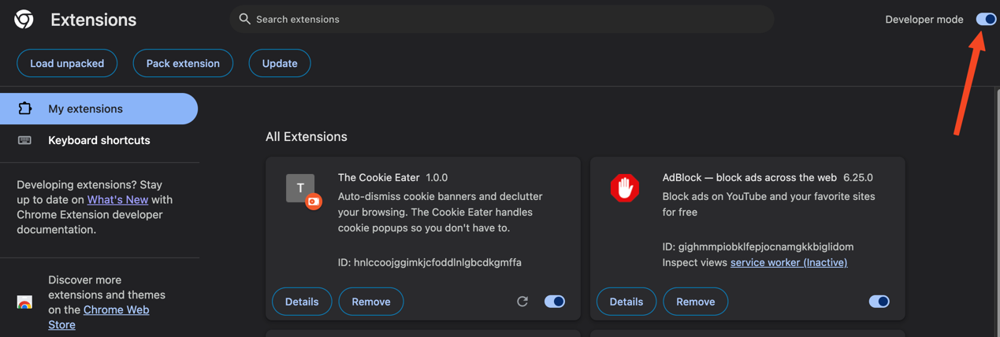
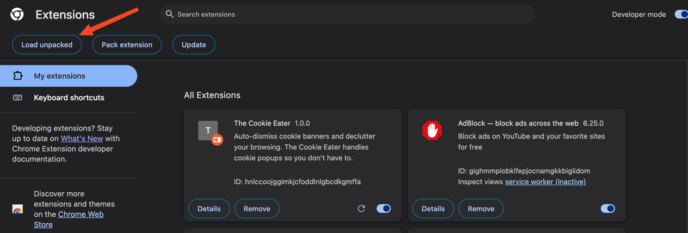

# How to use it?

We hope to be able to ship this to the Chrome Web Store soon, but for now,
the simplest way to use this extension is by following the steps below:

1. Clone this repo locally:

    ```bash
    git clone https://github.com/LewisDamy/the-cookie-eater.git
    ```

2. Open your Chrome browser and go to the following url:

    ```bash
    chrome://extensions/
    ```
    

3. Enable the Dev mode:

    

4. Load the extension by clicking the button and selecting the directory
   of the project on your computer:

    
